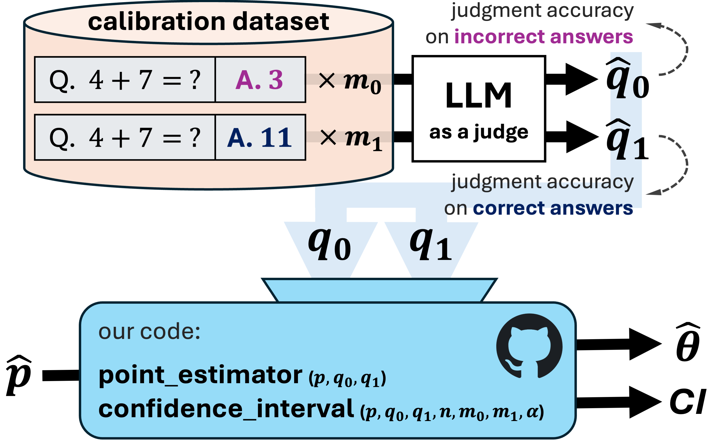

<h1 align="center"> <p>How to <em>Correctly</em> Report LLM-as-a-Judge Evaluations</p></h1>
<h3 align="center">
    <p>
        Chungpa Lee<sup>1</sup>,
        Thomas Zeng<sup>2</sup>,
        Jongwon Jeong<sup>2</sup>,
        Jy‑yong Sohn<sup>1</sup>,
        Kangwook Lee<sup>2,3</sup>
    </p>
    <p>
        <sup>1</sup>Yonsei University &nbsp;·&nbsp;
        <sup>2</sup>University of Wisconsin–Madison &nbsp;·&nbsp;
        <sup>3</sup>KRAFTON
    </p>
    <a href="./paper/How to Correctly Report LLM as a Judge Evaluations.pdf">
        
    </a>
    <a href="https://arxiv.org/abs/2511.21140">
    
</a>

</h3>

Large language models (LLMs) are increasingly used as evaluators in lieu of humans. While scalable, their judgments are noisy due to imperfect specificity and sensitivity of LLMs, leading to biased accuracy estimates. Although bias-correction methods exist, they are underutilized in LLM research and typically assume exact knowledge of the model's specificity and sensitivity. Furthermore, in general we only have estimates of these values and it is not well known how to properly construct confidence intervals using only estimates. This work presents a simple plug-in framework that corrects such bias and constructs confidence intervals reflecting uncertainty from both test and calibration dataset, enabling practical and statistically sound LLM-based evaluation. Additionally, to reduce uncertainty in the accuracy estimate, we introduce an adaptive algorithm that efficiently allocates calibration sample sizes.


## Overview
<p align="center">
  
</p>

- Bias‑adjusted point estimate: `theta = (p + q0 - 1) / (q0 + q1 - 1)`
  - Function: `point_estimator(p, q0, q1)` in `llm_judge_reporting/calibration.py`
- Confidence interval: reflects uncertainty from both test (`p`) and calibration (`q0`, `q1`)
  - Function: `confidence_interval(p, q0, q1, n, m0, m1, alpha)` in `llm_judge_reporting/calibration.py`
- Calibration set allocation: distribute total budget `m` across `m0` (specificity) and `m1` (sensitivity)
  - Function: `allocate_calibration_sample(m, p, q0_pilot, q1_pilot, m_pilot, eps=1e-6)` in `llm_judge_reporting/allocation.py`

- Key Inputs:
  - `p`: proportion judged “correct” on the test set, Pr(Predict = correct)
  - `q0`: specificity, Pr(Predict = incorrect | True = incorrect)
  - `q1`: sensitivity, Pr(Predict = correct | True = correct)
  - `n`: test set size; `m0`, `m1`: calibration subset sizes for false/true items

  - The judge is better than random: `q0 + q1 > 1` (otherwise the denominator vanishes).
  - Inputs are proportions in [0, 1] and counts are positive integers.

## Install
From GitHub:
```bash
pip install "git+https://github.com/UW-Madison-Lee-Lab/LLM-judge-reporting.git"
```

From source (editable, for development):
```bash
git clone https://github.com/UW-Madison-Lee-Lab/LLM-judge-reporting.git
cd LLM-judge-reporting
pip install -e .
```

## Usage

Point estimate and confidence interval:
```python
from llm_judge_reporting import point_estimator, confidence_interval

p = 0.4; n = 1000
q0 = 0.7; q1 = 0.9; m0 = 200; m1 = 200

th_hat = point_estimator(p, q0, q1)
ci = confidence_interval(p, q0, q1, n, m0, m1, alpha=0.05)
print(f"theta_hat = {th_hat:.4f}")
print(f"95% CI = ({ci[0]:.4f}, {ci[1]:.4f})")
```

Allocate calibration samples:
```python
from llm_judge_reporting import allocate_calibration_sample

p = 0.4
m = 200

m0, m1 = allocate_calibration_sample(m, p, q0_pilot=0.7, q1_pilot=0.9, m_pilot=10)
print("allocate m0,m1:", m0, m1)
```

## Figures
- Reproduce figures or further experiments:
  - Figure 2 (bias and adjustment) can be regenerated without the notebook:
    ```bash
    python -m run.figure2_bias_adjustment --output figures/figure2_bias_adjustment.png
    ```
  - Figure 3 (CI length vs. calibration size) without the notebook:
    ```bash
    python -m run.figure3_ci_length --output figures/figure3_ci_length.png
    ```
  - Figure 4 (Monte Carlo simulation) without the notebook:
    ```bash
    python -m run.figure4_monte_carlo --output figures/figure4_monte_carlo.png
    ```
- Notebooks remain available for exploratory runs: `figure2_bias and its adjustment.ipynb`, `figure3_confidence–interval length across calibration size.ipynb`, `figure4_Monte Carlo simulation.ipynb`

## Citation
```
@article{lee2025correctly,
  title         = {How to Correctly Report LLM-as-a-Judge Evaluations},
  author        = {Lee, Chungpa and Zeng, Thomas and Jeong, Jongwon and Sohn, Jy-yong and Lee, Kangwook},
  year          = {2025},
  eprint        = {2511.21140},
  archivePrefix = {arXiv}
}
```
